## Tiivistelmä ohjeesta Command line basics revisited

x) Lue ja tiivistä (Muutama ranskalainen viiva riittää. Tässä alakohdassa ei tarvitse tehdä testejä tietokoneella)
Karvinen 2020: Command line basics revisited (nämä komennot ja hakemistot kannattaa myös opiskella ulkoa ja harjoitella automaatiotasolle)'

## Komentorivitehtävät

Tehtävän aloitus 19:43.

Aloitin syöttämällä komennon sudo apt-get update.

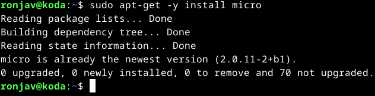

### Micron asennus

Micro minulla oli jo asennettuna ja myös ajan tasalla.

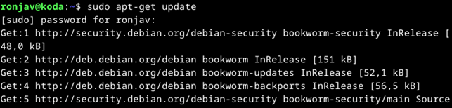

### Rauta

Annoin komennon sudo lshw -short -sanitize, mutta minun täytyi sitä ennen asentaa lshw. Asensin sen komennolla sudo apt-get -y install lshw.

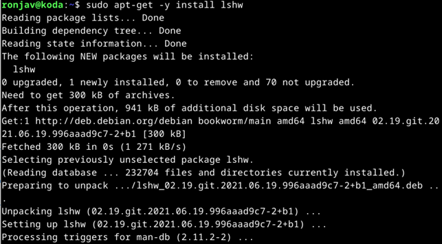

Sitten annoin komennon sudo lshw -short -sanitize uudestaan, ja sain seuraavat tiedot:

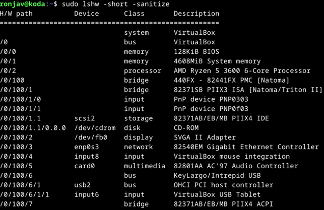
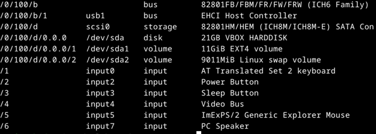

Tiedoista näki, että:
-BIOS vie tilaa 128 KiB
-Virtuaalikoneen RAM on kooltaan 4608 MiB
-Oman tietokoneeni prosessori on AMD Ryzen 5 3600 6-ytiminen prosessori
-PNP input-kohdassa tarkoittaa Plug and Play; ymmärtääkseni PNP-laitteet varmistavat yhteensopivuuksia automatisoidusti
-Tietokoneessani on CD-ROM -asema
-Tietokoneeseen voi liittää näytön; liitäntä noudattaa SVGA-standardia
-Tietokoneen voi yhdistää Internetiin
-Virtuaalikoneen kiintolevyn kapasiteetti on 21GB

### Ohjelmien asennusta ja testausta

Tero Karvisen ohjeen mukaan samalla komennolla (apt-get) voi asentaa useampia ohjelmia yhdellä komennolla. Niinpä etsin seuraavat ohjelmat ja asensin ne samalla komennolla
(ja kirjoitin kerran salasanani väärin):

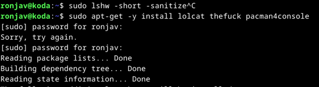

Lolcat: Tekee komentokehotteen tekstistä sateenkaaren värisen, ja sitä voi säädellä oman maun mukaan.

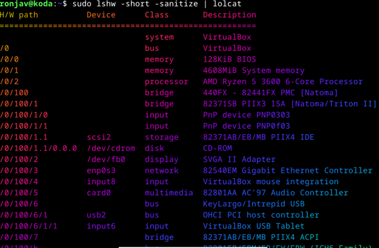

En onnistunut hyödyntämään Thefuck-ohjelmaa, joten asensin vielä Cowsayn.

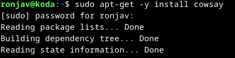

Cowsay:

 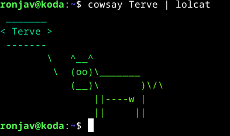
 
Pacman4console: Peli vaati suurempaa resoluutiota, enkä nyt kerennyt alkaa selvittää, kuinka resoluutiota voi säätää. 

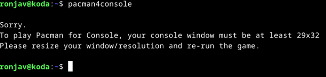

Asensin siis vielä uuden ohjelman, Angband-pelin:

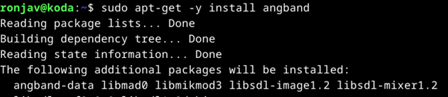
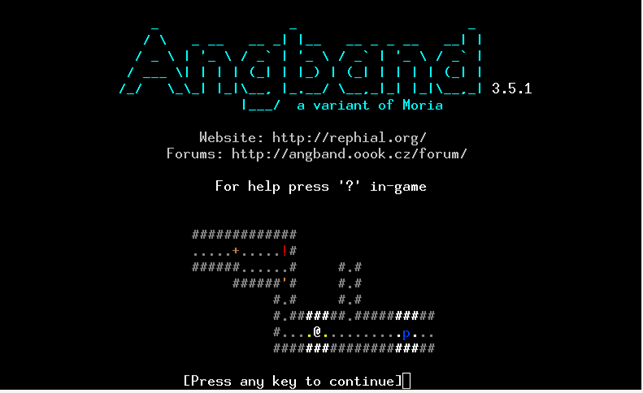

Ja eikun pelaamaan.

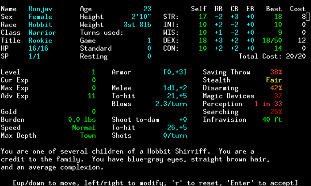

### FSH

Siirryin tehtävänannon mukaan hakemistoissa root- (juurihakemisto) ja home- (kotihakemisto) directoryyn sekä kotihakemiston kautta käyttäjäkohtaiseen directoryyn, jonka kansiot katsoin. 

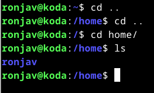
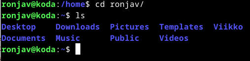

Sitten siirryin root directoryn kautta etc-directoryyn (all system wide settings), josta katsoin sen sisältämät tiedostot ja avasin niistä ensimmäisen. Kaikki tiedostot aukeavat tekstitiedostoina.

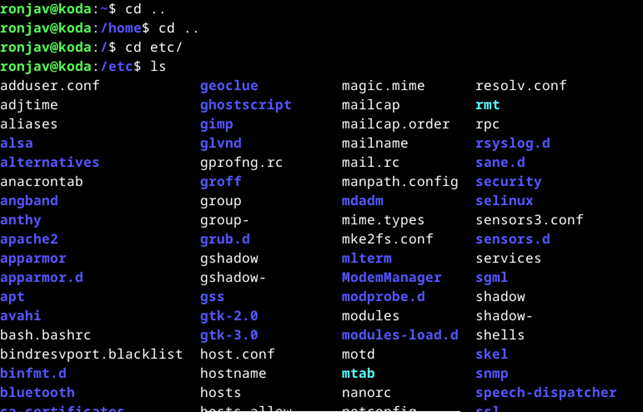

Media-hakemistossa ei ollut mitään.

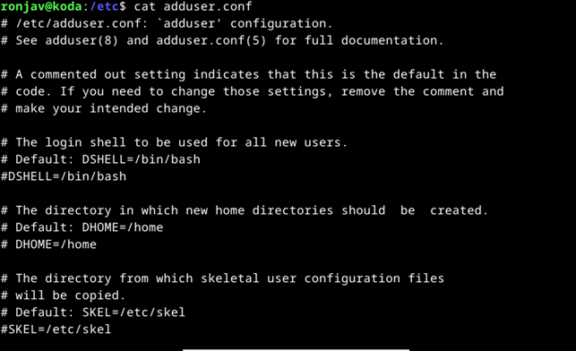

Avasin /var/log -hakemiston, ja kokeilin avata yhtä tiedostoa, mutta pääsy oli estetty.

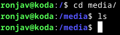

### Grep-komento

Kokeilin grep-komentoa Youtube-videon ohjeen avulla. Grep-komennolla voidaan hakea tiettyä tekstiä tiedostoista taikka syötteestä.

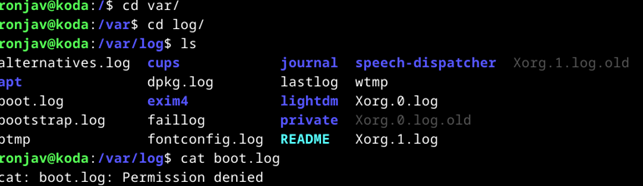

Sitten kokeilin pipeä kahdella tavalla, varmistaakseni, että ymmärrän sen toimintatavan. Lolcatia olinkin jo käyttänyt pipellä aikaisemmin. Pipe-symbolin | avulla voi ketjuttaa komentoja.

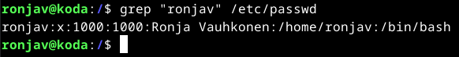
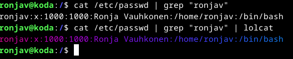

### Tukki
a) Micro. Asenna micro-editori
b) Rauta. Listaa testaamasi koneen rauta (‘sudo lshw -short -sanitize’). Asenna lshw tarvittaessa. Selitä ja analysoi listaus.
c) Apt. Asenna kolme itsellesi uutta komentoriviohjelmaa. Kokeile kutakin ohjelmaa sen pääasiallisessa käyttötarkoituksessa. Ota ruutukaappaus. Kaikki terminaaliohjelmat kelpaavat, TUI (text user interface) ja CLI (command line interface). Osaatko tehdä apt-get komennon, joka asentaa nämä kolme ohjelmaa kerralla?
d) FHS. Esittele kansiot, jotka on listattu "Command Line Basics Revisited" kappaleessa "Important directories". Näytä kuvaava esimerkki kunkin tärkeän kansion sisältämästä tiedostosta tai kansiosta. Jos kyseessä on tiedosto, näytä siitä kuvaava esimerkkirivi. Työskentele komentokehotteessa ja näytä komennot, joilla etsit esimerkit.
e) The Friendly M. Näytä 2-3 kuvaavaa esimerkkiä grep-komennon käytöstä. Ohjeita löytyy 'man grep' ja tietysti verkosta.
f) Pipe. Näytä esimerkki putkista (pipes, "|").
g) Tukki. Aiheuta lokiin kaksi eri tapahtumaa: yksi esimerkki onnistuneesta ja yksi esimerkki epäonnistuneesta tai kielletystä toimenpiteestä. Analysoi rivit yksityiskohtaisesti.

Lähteet:

https://terokarvinen.com/2024/linux-palvelimet-2024-alkukevat/#h2-komentaja-pingviini
https://terokarvinen.com/2020/command-line-basics-revisited/?fromSearch=command%20line%20basics%20revisited
https://www.techopedia.com/definition/1287/super-vga-svga
https://github.com/busyloop/lolcat
https://github.com/piuccio/cowsay
https://github.com/YoctoForBeaglebone/pacman4console
https://www.youtube.com/watch?v=U9SI-wYRD1M
